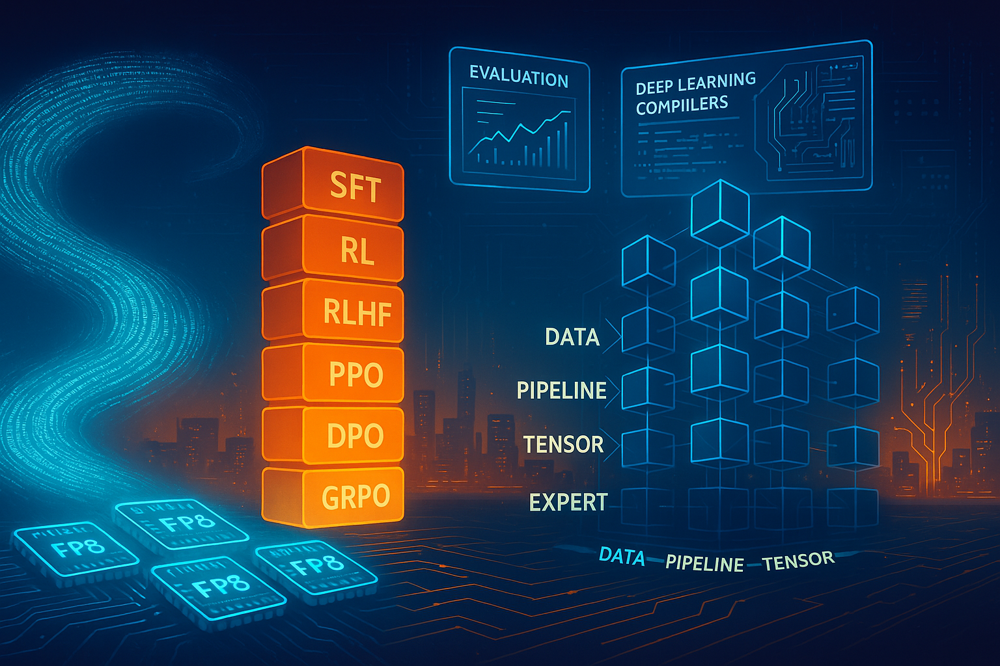

# AWSome AI Research

## Long context window
A Long Context Window is the expanded “working memory” of modern large-language models, now stretching from tens of thousands up to a million tokens—enough to fit entire books, codebases, or multi-hour transcripts in a single prompt. This leap matters because it changes how we build AI products: lawyers can review all deal documents in one shot, developers can refactor cross-repository code with full context, and support agents can reason over an entire customer history without losing track. Powered by efficient attention kernels like FlashAttention-3 and bandwidth-rich GPUs, long-context models slash the need for brittle chunking or retrieval glue code, cutting latency and hallucination risk while boosting accuracy. In short, bigger context isn’t just a spec bump—it’s the key that unlocks end-to-end reasoning over real-world scale data, making previously impossible workflows practical in 2025. [Ream more](lcw.md)

## Post training
In the post-DeepSeek era—where frontier models arrive pre-trained with trillion-token corpora yet still need domain-specific polish—LLM post-training techniques like parameter-efficient fine-tuning (LoRA, QLoRA), reward-based alignment (RLHF, GRPO), and retrieval-augmented adaptation (RAG-tuning) have become the critical last mile between a powerful base model and a production-ready specialist. These methods let teams inject fresh knowledge, enforce corporate guardrails, and optimize for nuanced objectives (factuality, brand tone, latency) without the ruinous cost of full re-training. Crucially, modern pipelines chain techniques—e.g., QLoRA to compress adapters, followed by GRPO to align behavior, then contrastive RAG-tuning to ground answers—so organizations can iterate rapidly as data, regulations, and user expectations evolve. In short, post-training is the lever that turns DeepSeek-class generalists into trustworthy, up-to-date experts, anchoring competitive advantage in 2025’s fast-moving AI landscape. [Read more](post-training/README.md)

## Low precision training
Low‑precision training is quickly becoming the default path to scale modern AI models because it slashes memory footprint, boosts arithmetic throughput, and lowers energy per FLOP without compromising accuracy when done carefully. On the software side, Meta’s TorchAO extends core PyTorch with native kernels, tensor subclasses, and end‑to‑end tooling for formats like FP8 and its sub‑8‑bit cousins FP6 and FP4, enabling up to 50 % higher training throughput in real‑world workloads. On the hardware side, NVIDIA’s new Blackwell B200 GPU is purpose‑built for these formats: its second‑generation Transformer Engine pushes FP8 performance further and introduces first‑class FP6/FP4 execution, unlocking as much as 20 PFLOPS of sparse FP4 compute for inference and dramatic speed‑ups for training
[Read More](low-precision/README.md)

## Mixture-of-Experts and EP
Mixture-of-Experts (MoE) models activate only a handful of specialised “experts” for each token, letting today’s giants pack trillion-scale capacity without paying trillion-scale FLOPs. That recipe powers DeepSeek V3’s 671 B-parameter transformer that lights up just 37 B per token, Meta’s first MoE-enabled Llama 4 lineup, and Alibaba’s Qwen3 series, which ships both dense and MoE variants for tasks from coding to chat. Expert Parallelism—the practice of spreading those experts across many GPUs and wiring them together with ultra-fast all-to-all links (e.g., NVSHMEM kernels that run up to 10 × faster than vanilla collectives)—is what turns the theory into a product: it keeps memory steady, inference latency low, and training bills sane even as models breach the trillion-parameter ceiling. In the post-DeepSeek age, MoE + Expert Parallelism has become the default scaling path, delivering frontier accuracy and domain versatility on hardware budgets that would have been unthinkable for dense models just two years ago. [Read more](moe.md)

## Eval
[Read more](eval/README.md)

## Communication
As models sprawl across dozens of GPUs, communication libraries are evolving just as fast as the networks they ride on. NVSHMEM pushes the envelope by giving each GPU a view of a partitioned global address space and letting kernels issue one-sided puts/gets directly on the NIC, eliminating CPU mediation and hiding latency; DeepSeek’s recent DeepEP work shows how this NVSHMEM path slashes MoE dispatch/combine overhead and sustains low-microsecond all-to-all latency on multi-rack clusters.[Read more](comm.md#nvshmem)

UCCL keeps the familiar NCCL API but rewrites the transport layer to spray packets over hundreds of network paths, add receiver-driven congestion control, and support heterogeneous GPUs; the result is up to 2.5×–3.7× higher throughput than NCCL for AllReduce/AlltoAll on on-prem HGX boxes and AWS p4d instances, all without touching user code. [Read more](comm.md#uccl)

