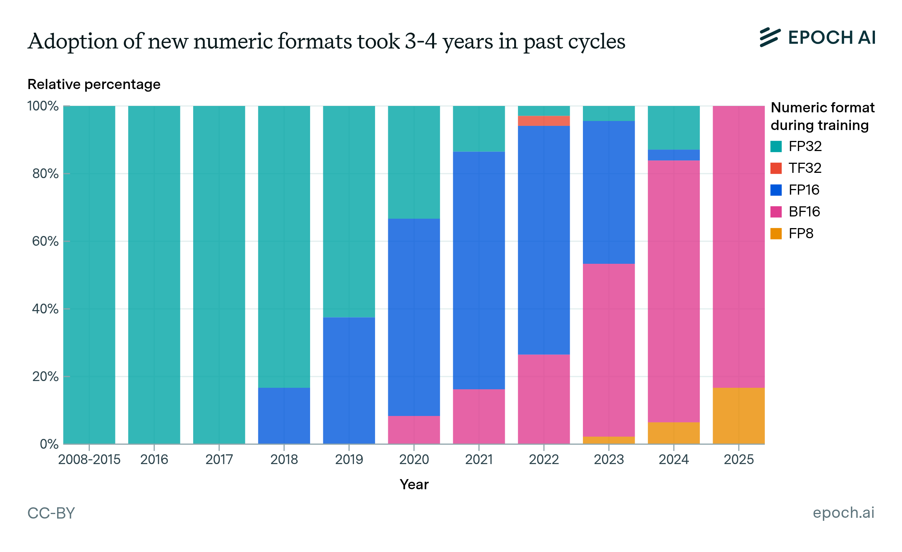

# Low Precision Training

## TorchAO: 
* https://github.com/pytorch/ao
* Quick Start Guide: https://docs.pytorch.org/ao/stable/quick_start.html

## MS-AMP
* https://github.com/Azure/MS-AMP
* https://azure.github.io/MS-AMP/docs/getting-started/installation
* Paper: https://arxiv.org/pdf/2310.18313

## Links
* HF Accelerate Low Precision Training Methods: https://huggingface.co/docs/accelerate/en/usage_guides/low_precision_training
* Low-Precision Training of Large Language Models: Methods, Challenges, and Opportunities: https://arxiv.org/pdf/2505.01043
* LLM.int8(): 8-bit Matrix Multiplication for Transformers at Scale: https://arxiv.org/pdf/2208.07339
* [[PyTorch Blog]HadaCore, a Hadamard Transform CUDA kernel](https://pytorch.org/blog/hadacore/)
* [[NVIDIA Blog]Floating-Point 8: An Introduction to Efficient, Lower-Precision AI Training](https://developer.nvidia.com/blog/floating-point-8-an-introduction-to-efficient-lower-precision-ai-training/)
* [[NVIDIA Blog]Per-Tensor and Per-Block Scaling Strategies for Effective FP8 Training](https://developer.nvidia.com/blog/per-tensor-and-per-block-scaling-strategies-for-effective-fp8-training)
