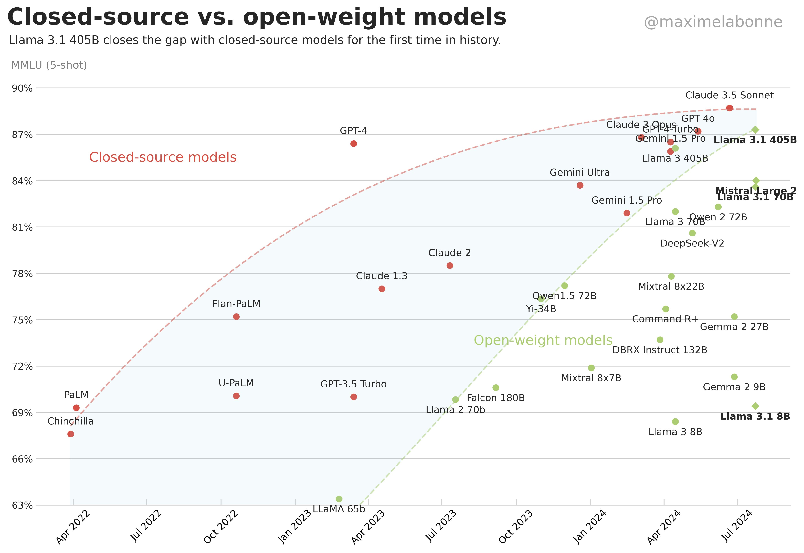

# Post-training

## Papers
* [LLM Post-Training: A Deep Dive into Reasoning Large Language Models](https://arxiv.org/pdf/2502.21321)
  * https://github.com/mbzuai-oryx/Awesome-LLM-Post-training
* [LARGE LANGUAGE MODELS POST-TRAINING: SURVEYING TECHNIQUES FROM ALIGNMENT TO REASONING](https://arxiv.org/pdf/2503.06072)
  * https://github.com/Mr-Tieguigui/LLM-Post-Training
 
## Frameworks
* https://github.com/huggingface/trl
* https://github.com/volcengine/verl
* https://github.com/OpenRLHF/OpenRLHF

# Links
* [François Chollet: How We Get to AGI](https://youtu.be/5QcCeSsNRks)
* [[Full Workshop] Reinforcement Learning, Kernels, Reasoning, Quantization & Agents — Daniel Han](https://youtu.be/OkEGJ5G3foU)

## Reinforcement Pre-Training
* [Reinforcement Pre-Training](https://arxiv.org/pdf/2506.08007)
  * https://huggingface.co/papers/2506.08007
  * https://aipapersacademy.com/reinforcement-pre-training/
